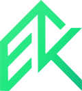

<div align="center">



# EgyKode

**The open-source Cloud &amp; DevOps learning platform.**

Learn the concepts, build the infrastructure, practise in hands-on labs, and
finish with projects you can actually deploy.

**[egykode.com](https://egykode.com)** · [Roadmaps](https://egykode.com/en/roadmaps/) · [Learn](https://egykode.com/en/learn/) · [Courses](https://egykode.com/en/courses/) · [Topics](https://egykode.com/en/topics/) · [Labs](https://egykode.com/en/labs/) · [Interview](https://egykode.com/en/prepare/questions/)

[](https://egykode.com)
[](LICENSE)
[](LICENSE-CONTENT)


[](https://hub.docker.com/r/waleeddarwesh/egykode)

</div>

---

EgyKode is an open-source learning platform for **Cloud, DevOps, Kubernetes,
Infrastructure as Code, CI/CD, GitOps, Observability, Security and SRE**.

The goal is simple:

**Learn → Practise → Build → Deploy**

Instead of collecting disconnected tutorials, EgyKode connects structured
chapters to ordered roadmaps, hands-on labs and deployable projects — and every
roadmap ends with something you can run, not a reading list.

## What is in the repository today

These numbers are counted from the corpus, not aspirational:

| | Count | |
|---|---|---|
| **Chapters** | 57 | Structured learning across 16 technology areas |
| **Topics** | 74 | Across 12 areas — *derived from the content, never hand-authored* |
| **Labs** | 114 | 56 guided (each with a challenge version), 3 incident labs and a challenge-only capstone |
| **Killercoda scenarios** | 45 | Browser-based interactive labs — no local setup required |
| **Roadmaps** | 4 | 11, 8, 8 and 8 phases |
| **Projects** | 6 | With attribution and licence metadata |
| **Interview questions** | 215 | 161 extracted from the chapters, plus 54 commonly-asked interview questions |

> **Topics are measured, not claimed.** `scripts/build-topics.mjs` derives every
> topic from the corpus and publishes one only when a chapter genuinely teaches
> it or a lab practises it. A topic page can never promise material that is not
> there, and the count grows on its own as content is added.

## ✨ Why EgyKode?

Cloud and DevOps learning often becomes a list of tools:

> Linux → Docker → Kubernetes → Terraform → AWS → Jenkins → …

EgyKode organises those tools around **engineering concepts and outcomes**. For
each one you should understand why it exists, what problem it solves, how it
fits into a larger system, how to operate it, how to secure it — and how to
build something with it.

Every topic in the corpus is checked for five things by
`scripts/audit-topics.mjs`: a definition, the mechanism, something runnable,
**how it fails**, and **the trade-off against the alternative**. A topic that
defines a thing beautifully and never shows it breaking is not finished.

## 🗺️ Learning paths

| Roadmap | Phases | Focus |
|---|---|---|
| **Cloud DevOps Engineer** | 11 | End-to-end Cloud &amp; DevOps engineering |
| **AWS Cloud Engineer** | 8 | AWS infrastructure, networking, security and operations |
| **Kubernetes Specialist** | 8 | Kubernetes administration, networking, packaging and operations |
| **DevSecOps** | 8 | Security integrated throughout the delivery lifecycle |

The roadmaps are deliberately different curricula rather than the same one
under four names. Phases exist only when there is material behind them — a
roadmap page shows its own content gaps rather than padding the phase count.

## 📚 Learning

Structured chapters covering Linux, Networking, Git &amp; GitHub, Docker, AWS,
Terraform, Ansible, Kubernetes, Helm, Kustomize, Jenkins, GitHub Actions,
GitOps, Argo CD, Prometheus, Grafana, Logging, DevSecOps, SRE, Disaster
Recovery, FinOps and Platform Engineering.

Code is highlighted at build time with Shiki, so the browser never downloads a
syntax highlighter.

## 🧪 Hands-on labs

Reading is not enough. Every lab is built on one principle: **build it
yourself.**

Three tiers, because following instructions is only the first of them:

| Tier | You get | You practise |
|---|---|---|
| 🟢 **Guided** | The objective and the steps | Doing it once, correctly |
| 🟡 **Challenge** | The same objective, no steps | Rebuilding it from understanding |
| 🔴 **Incident** | A broken system and a symptom | Diagnosing something nobody explained |

An incident lab never states the cause. You are given the failure — *502 Bad
Gateway*, a `CrashLoopBackOff`, service-to-service calls that time out — plus a
method for working the layers, and the root cause sits behind a reveal you read
only after a genuine attempt. That tier is the one closest to the job.

The labs are not a catalogue. They are laid out as one continuous build — the
**Project Path** — in ten phases, from an empty laptop to a containerised
application running on Kubernetes on AWS, delivered by a pipeline, watched by
Prometheus, and then deliberately broken. Each phase says why it exists and
what is true when you finish it, and the path ends with a capstone that gives
you a specification, five injected failures and no instructions.

**Every lab that provisions billable cloud resources says what it costs and how
to destroy it**, and a lint rule makes that a build error rather than a
convention — an EKS control plane left running over a weekend is about $73, and
a lab that does not mention it has failed the reader. Labs that delete data or
kill workloads on purpose are marked `destructive` as well.

### Killercoda — labs in the browser

45 labs are also available as [Killercoda](https://killercoda.com/) scenarios.
These run entirely in the browser — no Docker, no cloud account, no local
setup. Each scenario is generated from the same MDX source as the website labs
and validated by `npm run lint:killercoda`.

## 🖥️ Local lab environment

For labs that don't require cloud resources, EgyKode provides a fully
containerised local lab environment. Two Docker images — published to
[`waleeddarwesh/egykode`](https://hub.docker.com/r/waleeddarwesh/egykode) on
Docker Hub — give you a complete DevOps workstation without installing anything
on your host machine.

| Image | Tag | What it is |
|---|---|---|
| **Controller** | `controller-1.0` | Git, Ansible, Terraform, Kubectl, Helm, Docker — your workstation |
| **Node** | `node-1.0` | A managed node running `systemd` + `sshd` — your target server |

### Quick start (lab environment)

```bash
git clone https://github.com/Waleeddarwesh/EgyKode-lab.git
cd EgyKode-lab
./egykode start          # pulls the images, starts controller + node
./egykode shell          # drops you into the controller
ansible all -m ping      # proves it works
```

Optional profiles:

```bash
./egykode start k8s          # adds a 3-node Kind cluster
./egykode start cicd         # adds Jenkins on :8080
./egykode start observability # adds Prometheus + Grafana
```

> The lab environment lives in its own repository
> ([EgyKode-lab](https://github.com/Waleeddarwesh/EgyKode-lab)) so learners
> clone only the ~97 KB they need, not the 6+ MB website source. The two stay
> in sync via `npm run lint:lab-env` in CI.

## 🚀 Projects

Projects are where the curriculum comes together. They can be built by the
EgyKode team, contributed by the community, or imported from public GitHub
repositories with attribution and licence intact:

```bash
node scripts/import-github-project.mjs owner/repo --featured
```

## 🧭 Status

Being honest about what is finished matters more than a long feature list.

| Area | Status |
|---|---|
| **Live at [egykode.com](https://egykode.com)** | ✅ AWS S3 + CloudFront, deployed from `master` |
| Chapters, topics, roadmaps, labs, projects | ✅ Available |
| Local lab environment | ✅ Docker images on [Docker Hub](https://hub.docker.com/r/waleeddarwesh/egykode) |
| Killercoda browser-based labs | ✅ 45 scenarios |
| Interview question bank | ✅ Available |
| Search (⌘K), dark/light themes, reading progress | ✅ Available |
| Courses | ✅ Available |
| Community (profiles, Q&amp;A, groups, chat) | 🚧 Planned |
| Jobs | 🚧 Planned |
| Accounts &amp; cross-device sync | 🚧 Planned — progress is stored in your browser today |
| Arabic (RTL) | ⏸️ Built, currently switched off |

**On Arabic:** the RTL layout, the Arabic UI catalogue and two pilot chapters
exist and work. It is switched off because a language switcher that leads to
mostly-English pages is worse than no switcher. Re-enabling it is one line —
add `"ar"` to `PUBLIC_LOCALES` in [`apps/web/lib/locales.ts`](apps/web/lib/locales.ts)
and the switcher, `hreflang`, sitemap, pre-rendered routes and test matrix all
follow.

## 🏁 Quick start

```bash
git clone https://github.com/Waleeddarwesh/EgyKode.git
cd EgyKode
npm install
npm run dev            # http://localhost:3000
```

Node 20+ is required.

### Everyday commands

| Command | What it does |
|---|---|
| `npm run dev` | Dev server, after rebuilding tokens, topics and the search index |
| `npm run build` | Production build |
| `npm run verify` | **The gate** — every check below, then the E2E suite |
| `npm run topics` | Regenerate topics from the corpus |
| `npm run audit:topics` | Report how completely each topic is explained |
| `npm run doctor` | Check prerequisites for the local lab environment |
| `npm run lab-env:sync` | Regenerate the standalone lab-env mirror |
| `npm run lint:killercoda` | Validate all Killercoda scenarios |
| `npm run test:e2e` | Playwright critical paths |

### The checks

`npm run verify` runs these in order, and each one exists because something
broke once:

| Check | Catches |
|---|---|
| `lint:mdx` | Unescaped MDX hazards (`{`, `<`) outside code fences |
| `lint:diagrams` | Misaligned or inconsistent architecture diagrams |
| `content:lint` | Dead cross-links, banned phrasing, unlabelled code fences |
| `lint:killercoda` | Broken or invalid Killercoda scenario definitions |
| `audit:hazards` | Scenario steps that could damage a learner's system |
| `lint:lab-env` | Drift between the lab-env mirror and its source files |
| `lint:scenarios` | Drift between scenario mirrors and their sources |
| `lint:refs` | Broken file references across the codebase |
| `lint:resources` | Missing or unreachable external resources |
| `lint:rtl` | Physical-direction CSS that breaks RTL |
| `check:translation` | Translated code blocks, drifted headings, transliterated product names |
| `test:edge` | Edge-case routing and rendering |
| `typecheck` · `lint` | TypeScript strict, ESLint with zero warnings |
| `build:verify` | Full production build into an isolated directory |
| `test:e2e` | Critical reader paths, in every published locale |

> `build:verify` builds into `.next-verify` rather than `.next` on purpose:
> `next dev` and `next build` share an output directory, so verifying while a
> dev server is running used to rewrite its asset hashes and leave every
> stylesheet 404-ing.

## 🧱 Architecture

```text
apps/web/          Next.js 15 App Router · React 19 · TypeScript (strict)
content/           MDX chapters, labs, JSON roadmaps, projects, questions
packages/          Design tokens — one source of truth for colour
scripts/           Migration, generation and quality-gate tooling
docker/            Lab environment images (controller + managed node)
clusters/          Kind cluster configurations for local Kubernetes labs
killercoda/        Browser-based interactive lab scenarios
docs/master/       The specification, by section
```

Three decisions shape everything:

1. **Static content, dynamic community.** Chapters, roadmaps and labs build to
   static files on a CDN and never touch a backend. That is what makes running
   this nearly free.
2. **No NAT Gateway, no ALB, no EKS.** Those three cost roughly $125/month and
   are why most AWS free-tier projects generate a bill.
3. **Content-derived structure.** Topics, statistics and phase counts are
   computed from the corpus, so the site cannot advertise more than it teaches.

Running cost is about **$0.87/month** in year one (the domain; compute is inside
the AWS free tier) and **$6–14/month** at steady state.

## 📖 Documentation

[`MASTER_PROMPT.md`](MASTER_PROMPT.md) is the single source of truth — roughly
24,000 words covering vision, design system, i18n, architecture,
infrastructure, content standards and delivery phases. It is assembled from
[`docs/master/`](docs/master):

```bash
cat docs/master/*.md > MASTER_PROMPT.md
```

## 🤝 Contributing

Contributions are welcome — chapters, labs, projects, fixes and translations.

1. Fork and branch from `main`.
2. Make the change.
3. Run `npm run verify` — it must be green.
4. Open a pull request describing what a reader can now do that they could not
   before.

Adding a chapter or lab needs no code: add the MDX under `content/`, run
`npm run topics`, and the topic pages, search index and roadmap counts update
themselves.

## 📄 Licence

Code is **MIT**. Content — chapters, labs and diagrams — is
**CC BY-SA 4.0**. Imported projects keep their original licence and attribution.

<div align="center">

Built in the open, in Egypt, for everyone.

</div>
