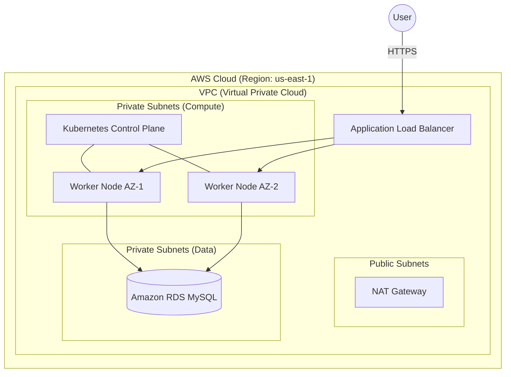

## Introduction to the Cloud-Native DevOps Platform

Welcome to the Cloud-Native DevOps Platform. This is not just a tutorial; this is a fully functional, enterprise-grade Infrastructure-as-a-Service (IaaS) and Platform-as-a-Service (PaaS) engine.

This documentation serves as the ultimate handbook for mastering DevOps. We will dissect every layer of this repository, from the bare-metal Cloud networks up to the highest level of automated GitOps deployments. 

Before we dive into the specific tools (Terraform, Kubernetes, Jenkins), we must first understand the *Project* itself. What are we actually building?

---

## Level 1 — Beginner

### What is this project?
Imagine you are starting a new pizza restaurant. 
Before you can bake a pizza, you need to buy a building, install electricity, set up an oven, hire chefs, and create a recipe book. 

In the software world, developers are the "chefs" and their code is the "pizza." 
This project automatically builds the entire restaurant for them. When a developer writes code, our system automatically creates the building (AWS Servers), installs the oven (Kubernetes), tests the recipe (Jenkins), and delivers the pizza to the customer (ArgoCD).

### Why do we need it?
If you don't have this system, every time a developer wants to launch a new app, a human has to manually click buttons on a screen to build a server, manually type commands to install software, and manually copy files. This is slow, causes human errors, and costs a lot of money.

### ASCII Diagram: The Old Way vs. Our Way

**The Old Way (Manual):**
```text
[Developer] --> Types code --> Emails code to IT Guy --> IT Guy logs into Server --> Clicks buttons --> ❌ Server crashes (Human Error)
```

**Our Project (Automated Platform):**
```text
[Developer] --> Types code --> Pushes to GitHub --> [🤖 Our Robot Platform] --> Tests Code --> Builds Server --> Deploys Code --> ✅ Success!
```

---

## Level 2 — Intermediate

### What problem does this solve?
This project solves the **"It works on my machine"** problem, and the **"Deployment Anxiety"** problem.
By utilizing a completely automated Cloud-Native Platform, we achieve:
1. **Consistency:** Environments (Dev, Staging, Prod) are identical because they are built from the same code.
2. **Speed:** Code goes from the developer's laptop to production in minutes, not months.
3. **Reliability:** Automated tests prevent broken code from reaching users.

### What existed before it?
Before Cloud-Native platforms, companies used **Monolithic Architectures** running on **Bare-Metal Servers**.
- You bought physical hardware (Dell/HP servers) and put it in a closet.
- You installed Linux manually using a CD-ROM.
- You copied your code onto the server using FTP or SSH.

### Why isn't the old solution enough?
- **Scaling:** If your app goes viral, you can't buy and plug in 10 physical servers fast enough. Your website crashes.
- **Blast Radius:** In a monolith, if a developer writes a bad line of code in the "Shopping Cart" feature, the entire website (including the "Login" page) goes offline.
- **Recovery Time:** If the physical server's hard drive dies, the company is offline for days while IT restores manual backups.

### How does our project use it?
Our repository acts as the **"Single Source of Truth."** 
If the entire AWS datacenter burns down, we do not panic. We run the scripts in this repository, and the entire platform (Network, Databases, Servers, CI/CD, Monitoring) is perfectly rebuilt in another region in less than 30 minutes.

### The Technology Stack (Overview)
- **AWS:** The Cloud Provider (Rents us the physical computers).
- **Terraform:** The Architect (Builds the AWS infrastructure).
- **Ansible:** The Plumber (Installs the software on the AWS computers).
- **Kubernetes:** The Manager (Runs the actual application containers).
- **Jenkins:** The Quality Assurance Tester (Tests the code).
- **ArgoCD:** The Delivery Driver (Puts the code into Kubernetes).
- **Prometheus/Grafana:** The Security Cameras (Monitors the health of the system).

---

## Level 3 — Advanced

### Production Architecture
Let's look at how this platform is designed for a true production environment.

When we say "Cloud-Native", we mean the system is designed to embrace failure. Servers *will* die. Networks *will* partition. Our architecture handles this autonomously.

1. **High Availability (HA):** Our Terraform modules spread the Kubernetes worker nodes across three physically separate data centers (Availability Zones: `us-east-1a`, `us-east-1b`, `us-east-1c`). If a flood destroys `us-east-1a`, the Application Load Balancer instantly reroutes traffic to `1b` and `1c`.
2. **Horizontal Scaling:** When CPU utilization spikes above 70%, the Kubernetes Horizontal Pod Autoscaler (HPA) commands the AWS Auto Scaling Group (ASG) to dynamically provision new EC2 instances, absorbing the traffic spike without human intervention.
3. **Disaster Recovery (DR):** The state of our cluster is not stored on the cluster itself. It is stored in a Git repository (GitOps). In a total disaster scenario, we bootstrap a new cluster and point ArgoCD to our GitHub repo; the cluster perfectly recreates its own state.

### Cost Optimization
Enterprise architecture is not just about technology; it's about money.
- **Why Self-Managed Kubernetes (`kubeadm`) instead of EKS?** AWS EKS charges ~$73/month just for the Control Plane (the API server). By using `kubeadm` on basic EC2 instances, we bypass the managed service fee, saving thousands of dollars at scale while maximizing our operational learning.

### Mermaid Diagram: High-Level Platform Architecture



---

## Level 4 — Enterprise

### Industry Best Practices & Platform Engineering
In Fortune 500 companies (like Netflix, Uber, or Spotify), they do not have "DevOps Teams" that just write CI/CD pipelines for developers. They have **Platform Engineering Teams**.

**What is Platform Engineering?**
Instead of holding the developer's hand for every release, the Platform team builds an Internal Developer Platform (IDP)—a self-service engine. 
This repository *is* the foundation of an IDP. We provide **"Golden Paths."** If a developer writes a Java application and puts a `Dockerfile` in their repo, our platform automatically inherits it, tests it via Jenkins Shared Libraries, and deploys it via ArgoCD. The developer never speaks to the Ops team. They just push code.

### Security, Compliance, and Zero Trust
Enterprise platforms must adhere to strict regulatory compliance frameworks like **SOC2** (System and Organization Controls) and **ISO27001**.
How does this repository achieve that?
1. **No Public IP Addresses:** Worker nodes reside strictly in Private Subnets. They are completely invisible to the public internet, satisfying SOC2 Network Security requirements.
2. **Zero Trust Networking:** Inside the Kubernetes cluster, we do not assume the network is safe. We use Calico Network Policies to enforce a default-deny stance. The Frontend pod is explicitly allowed to talk to the Backend pod, but if the Frontend pod is hacked, it is cryptographically blocked from scanning the rest of the cluster.
3. **Immutable Infrastructure:** We never SSH into a server to run `apt-get upgrade`. If a server needs patching, we update the AMI (Amazon Machine Image) in Terraform and roll out brand new servers, terminating the old ones. This eliminates "Configuration Drift."

### Incident Response (SRE)
In a Site Reliability Engineering (SRE) culture, we measure success in **SLIs (Service Level Indicators)** and **SLOs (Service Level Objectives)**.
Our platform is built to support this:
- **Metrics:** Prometheus scrapes system health every 15 seconds.
- **Alerting:** Alertmanager triggers PagerDuty if the Error Budget is burned too quickly.
- **Blameless Post-Mortems:** When the system fails (and it will), we don't fire the engineer. We fix the systemic flaw in this repository to ensure it can never happen again.

---

## Interview Questions

### Beginner
**Q: What is the difference between IaaS and PaaS?**
A: IaaS (Infrastructure as a Service) is renting the raw hardware (like AWS EC2). PaaS (Platform as a Service) provides the hardware *and* the operating system/tools so developers can just focus on code (like Heroku, or the Kubernetes platform we are building in this project).

### Intermediate
**Q: Why do we use both Terraform and Ansible? Why not just use one?**
A: They serve different purposes. Terraform is an Infrastructure Provisioner (it declares the existence of a server, network, or database in AWS). Ansible is a Configuration Manager (it connects to the server Terraform created and installs software on it). While they have overlapping features, using Terraform for hardware and Ansible for software is the industry standard.

### Senior
**Q: How does this platform handle the "Split-Brain" problem in a Multi-AZ disaster scenario?**
A: Our Control Plane utilizes `etcd` as its distributed key-value store. `etcd` requires a strict quorum (majority) to elect a leader and commit changes (using the Raft consensus algorithm). By distributing exactly 3 Control Plane nodes across 3 Availability Zones, the system can sustain the total loss of 1 AZ. The remaining 2 nodes maintain a quorum (2/3) and the cluster remains fully operational and writeable.

### Principal/Architect
**Q: Compare the operational overhead of a GitOps-driven Self-Managed Kubernetes cluster vs. a Managed Service like EKS integrated with a traditional push-based CI pipeline.**
A: A GitOps-driven Self-Managed cluster (our architecture) shifts the operational burden to the Platform team (managing etcd backups, API certificate rotations, and kubelet upgrades). However, it guarantees absolute configuration synchronization; the cluster continuously pulls state from Git, neutralizing configuration drift and ensuring disaster recovery is deterministic. EKS reduces the control plane management burden significantly, but if paired with a push-based CI (e.g., Jenkins running `kubectl apply`), it introduces security vulnerabilities (CI requires cluster admin credentials) and risks drift if engineers manually edit cluster state via the AWS console. The architectural tradeoff is Operational Effort (Self-Managed) vs. Security/Determinism (GitOps).
[Contents](/learn) | [02 — System Architecture](/learn/platform/system-architecture) |
