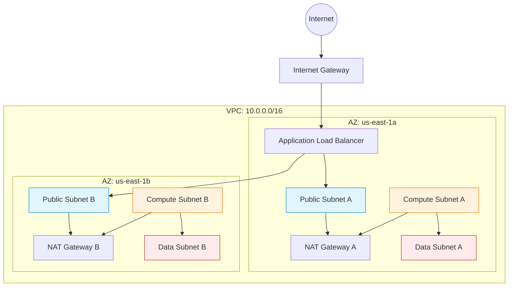

## Introduction to the Architecture

In Chapter 01, we learned *why* we are building this platform. Now, we will look at *how* the pieces fit together.
System Architecture is the blueprint of our platform. It defines how the network is structured, where the servers live, how the database is protected, and how traffic flows from a user's browser into our backend code.

### The whole platform, on one page


**Do not try to absorb this yet.** Right now, find four things on it — that is
all this chapter needs from you:

1. **The green line along the top.** That is a user's request: Route 53 → load
   balancer → ingress controller → application. Trace it with your finger.
2. **The numbered column on the left.** That is the build pipeline, stages 1
   to 9. You will build it in Chapter 23.
3. **The three `AZ-a / AZ-b / AZ-c` columns in the middle.** Everything
   important exists three times, once per availability zone. That repetition
   *is* high availability.
4. **The black dashed line at the bottom**, from the pipeline to GitHub to
   ArgoCD. That is the GitOps loop, and it is the most important idea in this
   platform — Chapter 27 is entirely about why it points that direction.

Come back to this diagram at the end of every phase. It will make more sense
each time, and by Chapter 40 you will be able to redraw it from memory — which
is, incidentally, a very good interview answer.

> Prefer text? [architecture.txt](../Cloud-Native-DevOps-Platform/diagrams/architecture.txt)
> carries the same content with per-AZ detail, and diffs cleanly in a pull request.

---

## Level 1 — Beginner

### What is System Architecture?
Imagine building a city. You don't just throw houses and roads everywhere. You need a city planner.
- You build a **highway** to let people in (The Internet / Load Balancer).
- You zone an area for **shopping malls** where people interact (Public Subnets).
- You zone a high-security area for **banks** where money is kept, and you put guards at the door (Private Subnets / Database).

Our System Architecture is the city plan for our software.

### The Problem it Solves
If you put your database on a public network, a hacker can easily try to guess the password. By designing a secure architecture, we place the database behind locked doors, where *only* our specific applications can talk to it.

### ASCII Diagram: The City Plan

```text
       [ The Internet ]
              |
      (Front Gate / ALB)
              |
+-----------------------------+
|        PUBLIC ZONE          |
|  (Allows internet traffic)  |
|      [ NAT Gateway ]        |
+-----------------------------+
              |
+-----------------------------+
|        PRIVATE ZONE         |
| (No direct internet access) |
|   [ Kubernetes Servers ]    |
+-----------------------------+
              |
+-----------------------------+
|      TOP SECRET ZONE        |
|  (Only K8s can enter here)  |
|       [ Database ]          |
+-----------------------------+
```

---

## Level 2 — Intermediate

### How it Works Internally (The Network Topology)

Our architecture is deployed into **AWS (Amazon Web Services)**. It uses a **Virtual Private Cloud (VPC)**. A VPC is a logically isolated section of the AWS cloud. 

Inside the VPC, we slice the IP addresses into smaller chunks called **Subnets**:
1. **Public Subnets:** These subnets have a route to an Internet Gateway. The only thing we place here are Load Balancers (which receive traffic from users) and NAT Gateways (which allow our private servers to download software updates).
2. **Private Compute Subnets:** This is where our Kubernetes Worker Nodes and Control Plane live. They do not have public IP addresses. You cannot SSH into them from your house.
3. **Private Data Subnets:** This is the deepest layer of the network. Our Amazon RDS MySQL database lives here. It is completely isolated. 

### What Existed Before? (Flat Networks)
In the old days, companies used "Flat Networks". Every server, including the database, had a public IP address. They relied entirely on software firewalls to block hackers. If a firewall crashed, the database was instantly exposed to the world. Our architecture prevents this at the hardware/routing layer.

### The Request Flow
1. A user types `https://api.example.com`.
2. DNS resolves to the **AWS Application Load Balancer (ALB)** in the Public Subnet.
3. The ALB terminates the SSL certificate (decrypts the HTTPS traffic).
4. The ALB forwards the raw HTTP traffic to a **Kubernetes Worker Node** in the Private Subnet.
5. The Kubernetes `kube-proxy` routes the traffic to the specific **Pod** running our API.
6. The Pod queries the **RDS Database** in the Data Subnet.

---

## Level 3 — Advanced

### Production Architecture: Multi-AZ High Availability

An AWS Region (like `us-east-1` in Virginia) is composed of multiple **Availability Zones (AZs)**. An AZ is a distinct, physical data center with its own power grid and flood plains.

If we put all our servers in `us-east-1a`, and a fire destroys that building, our company goes offline.
To achieve High Availability, our Terraform architecture mathematically distributes subnets across 3 AZs.

### Deep Dive: Analyzing the Network Configuration (Real Code)

Let's look at how this is actually built in our repository. Open `infrastructure/terraform/environments/prod/main.tf` and look at the `network` module call:

```hcl
module "network" {
  source = "../../modules/vpc"

  name_prefix          = local.name_prefix
  aws_region           = var.aws_region
  vpc_cidr             = var.vpc_cidr
  availability_zones   = var.availability_zones
  single_nat_gateway   = false # Critical Architecture Decision!
  enable_flow_logs     = true
  flow_logs_bucket_arn = module.storage.logs_bucket_arn
  tags                 = local.common_tags
}
```

**Line-by-Line Breakdown:**
- **`vpc_cidr`**: E.g., `10.0.0.0/16`. This gives us 65,536 private IP addresses. The VPC module internally divides this into 9 subnets (3 Public, 3 Compute, 3 Data).
- **`availability_zones`**: A list like `["us-east-1a", "us-east-1b", "us-east-1c"]`. The module loops over this list to create the physical distribution.
- **`single_nat_gateway = false`**: 
  - *The Alternative:* If true, we deploy 1 NAT Gateway for the entire VPC. It saves money ($32/month).
  - *The Problem:* If the AZ containing that single NAT Gateway goes offline, the other 2 AZs lose internet access (they can't download Docker images).
  - *The Architecture Choice:* By setting this to `false`, we deploy 3 separate NAT Gateways (one per AZ). This removes the single point of failure (SPOF). We pay 3x the cost, but guarantee fault tolerance.
- **`enable_flow_logs = true`**: Captures metadata about every packet traversing the VPC for security forensics.

### Mermaid Diagram: Complete Network Flow



---

## Level 4 — Enterprise

### Enterprise Patterns: Zero Trust and Compliance
Fortune 500 companies operating under **PCI DSS** (Payment Card Industry) or **HIPAA** (Healthcare) compliance require strict network architectures.

1. **Egress Filtering:** It is not enough to block inbound traffic. What if a server is infected with malware? The malware will try to phone home to a Command and Control (C2) server. In an enterprise environment, we replace standard AWS NAT Gateways with **Transit Gateways** attached to Next-Generation Firewalls (like Palo Alto) to perform Deep Packet Inspection (DPI) on *outbound* traffic.
2. **VPC Peering vs. Transit Gateway:** As a company grows, it will have multiple VPCs (e.g., HR VPC, Finance VPC, Prod VPC). Connecting them via VPC Peering creates a complex, unmanageable "spiderweb" mesh. Enterprise architecture uses a **Hub-and-Spoke** model with a AWS Transit Gateway acting as the central router.

### Platform Engineering: Scalability Limits
When designing this architecture, we must calculate theoretical limits:
- A `/16` VPC supports 65k IPs.
- If we use AWS VPC CNI for Kubernetes, every single Pod consumes a real IP address from the VPC.
- In a massive microservices environment with 10,000 Pods, we will rapidly suffer from **IP Exhaustion**.
- *Solution:* Our architecture specifically chose **Calico CNI** instead of AWS VPC CNI. Calico uses an overlay network (e.g., `192.168.0.0/16` internal to the cluster). Pod IPs do not consume VPC IPs. We trade a microsecond of encapsulation overhead to guarantee we never run out of AWS IP addresses.

---

## Interview Questions

### Beginner
**Q: What is the difference between a Public Subnet and a Private Subnet?**
A: A Public Subnet has a routing table entry pointing to an Internet Gateway, allowing servers inside it to be reached from the public internet. A Private Subnet does not; its servers are completely hidden from the outside world.

### Intermediate
**Q: Why do we put a NAT Gateway in a Public Subnet, but point Private Subnets to it?**
A: Private servers often need to download updates or API data from the internet. They send their request to the NAT (Network Address Translation) Gateway. The NAT Gateway, sitting in the Public Subnet, acts as a middleman. It forwards the request to the internet on behalf of the private server, and sends the response back, ensuring the private server's IP address is never exposed.

### Senior
**Q: How do you secure database access across different VPCs without traversing the public internet?**
A: You can use VPC Peering (for simple 1-to-1 connections) or AWS Transit Gateway (for complex hub-and-spoke topologies). Both route traffic entirely across the internal AWS backbone. Alternatively, for exposing specific services, AWS PrivateLink allows one VPC to consume an endpoint in another VPC securely.

### Principal/Architect
**Q: In an active-active multi-region architecture (e.g., `us-east-1` and `eu-west-1`), how do you handle stateful data synchronization and routing?**
A: Routing is handled via Route53 latency-based or geolocation routing. For stateful data, we must utilize global databases (like Amazon Aurora Global Database or DynamoDB Global Tables) which replicate storage synchronously or asynchronously at the block level. The architectural tradeoff is latency vs. consistency (CAP Theorem): synchronous replication guarantees consistency but adds high latency across regions, whereas asynchronous replication is fast but risks data loss during an abrupt region failure.
[Contents](/learn) | [03 — Platform Requirements](/learn/platform/requirements) |
